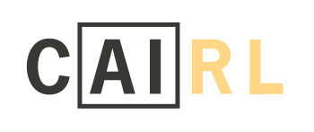
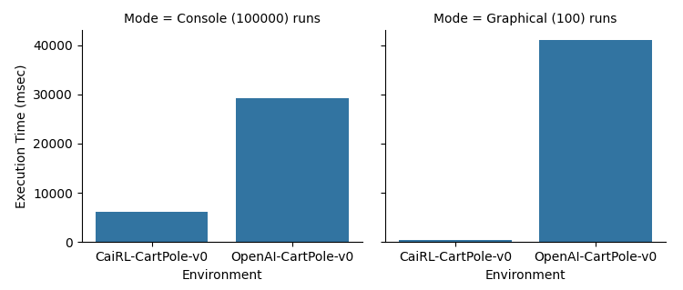

# CaiRL - A Reinforcement Learning Environment Suite

CaiRL is a fast and efficient environment test-bench for reinforcement learning (RL) research.

CaiRL focus on being fully compatible with [OpenAI Gym](https://github.com/openai/gym) but with magnitude faster execution times.
```python
 # Running OpenAI Gym
import gym
env = gym.make("CartPole-v0")
for episode in range(10):
    env.reset()
    terminal = False
    while not terminal:
        state, reward, terminal, info = env.step(env.action_space.sample())
        # Do Reinforcement Learning Stuff here ...    
    
# Running CaiRL Environment Suite
import cairl.gym
env = cairl.gym.make("CartPole-v0")
for episode in range(10):
    env.reset()
    terminal = False
    while not terminal:
        state, reward, terminal, info = env.step(env.action_space.sample())
        # Do Reinforcement Learning Stuff here ...
 ```
Okay so you have made a copy of OpenAI Gym, so what?


Do I need to say more?


<html>
<!--
## Cite
If you use CaiRL in your work, please cite the following paper:
```
TODO
```-->
</html>


# Requirements
1. Python >= 3.6

# Installing
`pip install https://github.com/cair/rl`


# Environments
The following environments are included as of this commit:
1. Deep Maze (Python) (Done)
2. Deep RTS (C++) (Done)
3. Deep Warehouse (Python) (Done)
4. Deep Line Wars 1 (Python) (Done)
5. Deep Line Wars 2 (C++) (TODO, GUI needs rewrite)
6. Flash RL (C++) (Done)
7. Hex AI (C/C++) (Done)
8. X1337 Space Shooter (C++) (Done Partially)
9. Classic Control (C++) (Done)

Note that not all environments are implemented in full CaiRL Gym style, but this is eventually the goal, including adding new games/problems/environments in the future!

Feel free to put up a issue on the tracker if you find any bugs.

# Licence
Copyright 2021 Per-Arne Andersen

Permission is hereby granted, free of charge, to any person obtaining a copy of this software and associated documentation files (the "Software"), to deal in the Software without restriction, including without limitation the rights to use, copy, modify, merge, publish, distribute, sublicense, and/or sell copies of the Software, and to permit persons to whom the Software is furnished to do so, subject to the following conditions:

The above copyright notice and this permission notice shall be included in all copies or substantial portions of the Software.

THE SOFTWARE IS PROVIDED "AS IS", WITHOUT WARRANTY OF ANY KIND, EXPRESS OR IMPLIED, INCLUDING BUT NOT LIMITED TO THE WARRANTIES OF MERCHANTABILITY, FITNESS FOR A PARTICULAR PURPOSE AND NONINFRINGEMENT. IN NO EVENT SHALL THE AUTHORS OR COPYRIGHT HOLDERS BE LIABLE FOR ANY CLAIM, DAMAGES OR OTHER LIABILITY, WHETHER IN AN ACTION OF CONTRACT, TORT OR OTHERWISE, ARISING FROM, OUT OF OR IN CONNECTION WITH THE SOFTWARE OR THE USE OR OTHER DEALINGS IN THE SOFTWARE.

